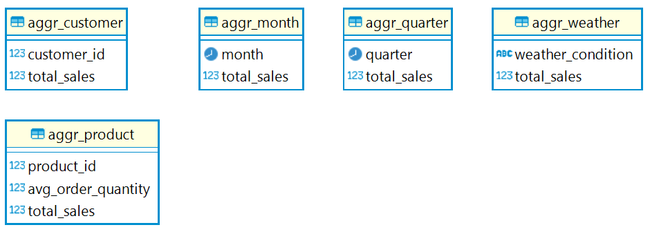

# sales_pipeline

## Setup

### Prerequisites
 - Install git from https://github.com/git-guides/install-git
 - Install Docker from https://docs.docker.com/engine/install/ for your platform
 - [dev-only] Install Python from https://www.python.org/downloads/
 - [dev-only] `pip install -r requirements.txt`

### Steps
 - Launch Docker
 - Open a terminal, go to your prefered directory, and run `git clone https://github.com/dr-birdkiwi/sales_pipeline.git`
 - Run `docker-compose up`

## Usage
### Navigate Airflow UI
 - Visit the Airflow UI via `http://localhost:8080/`
    - username: `airflow`
    - password: `airflow`
 - Enable the DAG named `sales_pipleine`

 - Enter the DAG named `sales_pipeline` and trigger it by clicking the triangle on the right hand side

### Navigate PostgresDB
 - Use your preferred tool to connect to the PostgresDB
    - host: localhost
    - port: 5432
    - db_name: postgres
    - username: airflow
    - password: airflow
 - All the tables are located under the `public` schema
 

## High Level Architecture

### Extract & Load
 - Source data are first extracted and saved as csv files locally
 - The csv files are then loaded into postgres db. Either truncate & load, or insert only.
    - `stg_sales`
    - `stg_users`
    - `stg_weather`
 - The staging tables are supposed to match the source.

### Transform
 - Dedup
    - `dedup_weather` stores the last record for each city and each day
 - Merged
    - `merged_sales` stores all the sales orders along with user information and weather information
 - Aggregated
    - `aggr_customer`
    - `aggr_product`
    - `aggr_month`
    - `aggr_year`
    
### Dependencies
Dependencies are defined in the Airflow DAG.

 - `db_init`: Create all the staging tables
 - `el_sales`: Extract and load sales csv file to `stg_sales`
 - `el_users`: Extract and load users API data to `stg_users`
 - `et_weather`: Extract and load weather API data to `stg_weather`
 - `db_transform`: Transform staging tables to other tables

## Data Models

### Staging

### Dedup & Merged

### Aggregated

## Code Structure

 - `dag.py`: The main entrance where all the tasks and their dependencies are defined
 - `tasks`: The folder to save all the functions used directly by the tasks in `dag.py`
 - `helper`: All the helper functions to avoid duplicate codes
 - `data`: Saves the provided `sales_data.csv`
 - `sql`
   - `ddl.sql`: All the DDL scripts to create all the required staging tables
   - `transformation.sql`: All the scripts to create other tables

## Analytics
### How averge price affects sales quantity?

### Customer Purchase Summary
